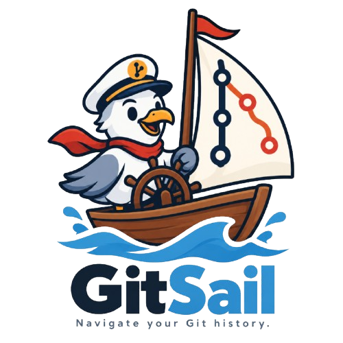
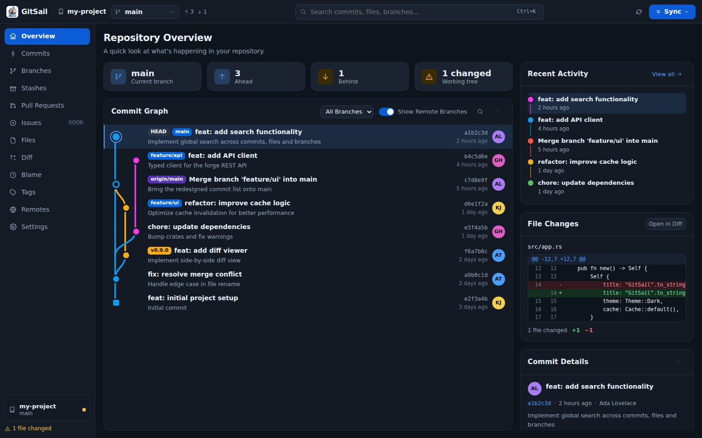
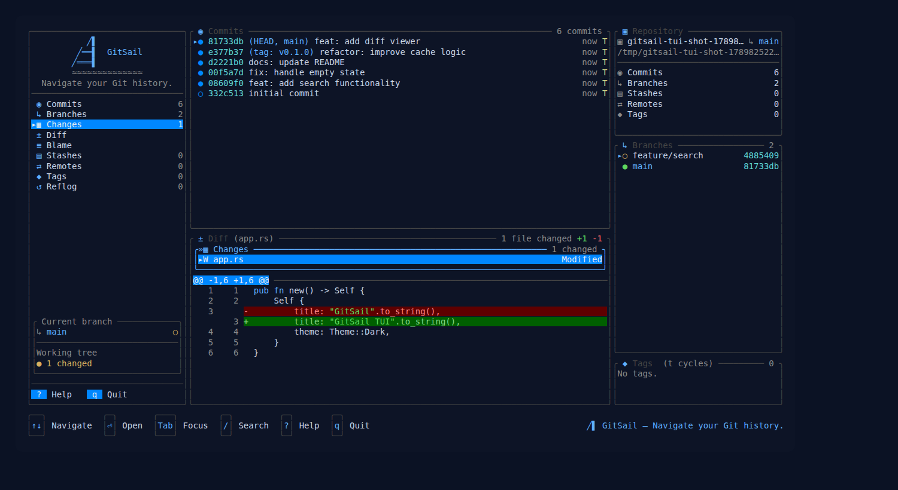

<div align="center">



**Navigate your Git history.**

One Rust core. Four ways to use it: command line, terminal UI, desktop app, and VS Code.

[](https://github.com/rpaggi/gitsail/actions/workflows/ci.yml)
[](https://github.com/rpaggi/gitsail/releases)
[](LICENSE)
[](https://www.rust-lang.org)
[](https://github.com/rpaggi/gitsail/releases)
[](CONTRIBUTING.md)

</div>

---

## What it is

GitSail is an open-source Git client built around a single shared Rust core. The
same domain, the same Git adapter and the same use cases power every interface,
so `gitsail log`, the TUI's commit graph and the Desktop's history view cannot
drift apart — they are literally the same code.

It never reimplements Git. It shells out to the real `git` you already have
installed (ADR-003), so your hooks, credential helpers, SSH agent and config keep
working exactly as they do today.

**No account. No telemetry. No network calls you did not ask for.**

## Screenshots

**Desktop** — Tauri v2 + Vue 3

<div align="center">

</div>

**Terminal UI** — Ratatui

<div align="center">

</div>

## Install

### Download a build

Grab the latest build from the [releases page](https://github.com/rpaggi/gitsail/releases).

| You want | Download |
|---|---|
| CLI + TUI | `gitsail-<version>-<platform>.tar.gz` (`.zip` on Windows) |
| Desktop, Windows | `GitSail_<version>_x64-setup.exe` or the `.msi` |
| Desktop, macOS | `GitSail_<version>_aarch64.dmg` |
| Desktop, Linux | the `.AppImage` or `.deb` |
| VS Code extension | `gitsail-vscode-<version>.vsix` |

Every release ships a `SHA256SUMS.txt` covering all assets — check your download
against it. Builds are **not** code-signed or notarized yet, so Windows
SmartScreen and macOS Gatekeeper will warn on first launch. That is a recorded,
deliberate decision (ADR-023), not an oversight; see the
[release process](docs/architecture/release-process.md).

### Build from source

```sh
git clone https://github.com/rpaggi/gitsail.git
cd gitsail
cargo build --release -p gitsail-cli -p gitsail-tui

# the interactive-rebase helper must sit next to the binary
install -m755 target/release/gitsail target/release/gitsail-tui \
              target/release/gitsail-sequence-editor ~/.local/bin/
```

**Requirements:** Git 2.31+ on `PATH`, Rust 1.97.0+ (the workspace MSRV). Node 18+
only if you also build `apps/desktop` or `apps/vscode`. On Linux the Desktop app
additionally needs the WebKitGTK/GTK/D-Bus development libraries Tauri v2 links
against.

## Use it

Run `gitsail` with no subcommand and you land straight in the terminal UI:

```sh
gitsail                      # opens the TUI (same as `gitsail tui`)
```

Or use it as a plain query tool — every command speaks human text by default and
a versioned JSON envelope with `--json`, so it scripts cleanly:

```sh
gitsail status
gitsail log --limit 20 --author alice
gitsail diff HEAD~1 HEAD
gitsail blame src/main.rs --range 10-40
gitsail log --json | jq '.data.items[].subject'
```

The TUI needs a terminal of at least **78×20**. Press `?` inside it for every
shortcut. Colors and symbols degrade to plain ASCII with `--ascii` or `NO_COLOR=1`.

## What works today

| Area | Status |
|---|---|
| Browse: status, log, graph, diff, blame, line history, file contents | Yes |
| Branches: create, checkout, rename, delete | Yes |
| Commit, stage/unstage, amend | Yes |
| Merge, rebase (including interactive plans), cherry-pick, revert, reset | Yes |
| Conflict resolution with explicit continue / skip / abort | Yes |
| Fetch, pull, push | Yes |
| Tags, stashes, remotes, reflog, worktrees | Core and Desktop; read-only in the TUI |
| Pull/merge request listing (GitHub, GitLab) | Desktop only |
| Force-push, mid-operation cancellation | Deliberately not implemented |

Destructive and moderate operations always ask first, and declining one leaves the
repository untouched — a structural guarantee, not a convention. The
[preferences matrix](docs/architecture/preferences-matrix.md) carries the proof.

## Architecture

Ports & Adapters, enforced by a CI fitness function rather than by good
intentions: `gitsail-git` is the only crate allowed to invoke `git`, and
`scripts/ci/check-architecture.sh` fails the build if that ever stops being true.

```
crates/
  gitsail-domain        pure model, no I/O
  gitsail-application   use cases and ports
  gitsail-git           the only crate that runs `git`
  gitsail-protocol      DTOs shared with every frontend
  gitsail-cli           command line
  gitsail-tui           terminal UI (Ratatui)
  gitsail-forge         forge APIs, keyring, update checks
apps/
  desktop               Tauri v2 + Vue 3 + TypeScript
  vscode                VS Code extension
```

The [Software Architecture Document](docs/architecture/GitSail_SAD_and_ADRs_v0.1.md)
carries the full design plus every Architecture Decision Record — each one
numbered, dated, and never renumbered.

## Documentation

- **Manuals** — [TUI](docs/manual/tui.md) · [Desktop](docs/manual/desktop.md) · [VS Code](docs/manual/vscode.md) · [Troubleshooting](docs/manual/troubleshooting.md)
- **Architecture** — [SAD and ADRs](docs/architecture/GitSail_SAD_and_ADRs_v0.1.md) · [CI policy](docs/architecture/ci-policy.md) · [Release process](docs/architecture/release-process.md) · [Performance baseline](docs/architecture/performance-baseline.md) · [Protocol compatibility](docs/architecture/protocol-compatibility.md)
- **Product** — [Backlog](docs/product/GitSail_Product_Backlog_v1.0.md) · [PRD](docs/product/GitSail_PRD_v0.1-v1.0.md) · [Brand identity](docs/product/brand-identity.md)
- **What is next, and what is still undecided** — [roadmap and open decisions](docs/manual/roadmap-and-open-decisions.md)

Planning documents are written in Portuguese for the product owner; code and
technical documentation are in English.

## Contributing

Contributions are welcome. [CONTRIBUTING.md](CONTRIBUTING.md) covers the build and
test setup, the architecture boundaries a change must respect, and how to propose
changes to the PRD/SAD/ADRs without breaking their history.

Before opening a PR, run the same gates CI runs:

```sh
cargo test --workspace
cargo clippy --workspace --all-targets -- -D warnings
cargo fmt --all -- --check
./scripts/ci/check-architecture.sh
```

## License

[Apache License 2.0](LICENSE). ADR-021 records why Apache-2.0 over MIT, alongside
the minimum Git version, the Rust MSRV and the pre-1.0 versioning policy.

Trademark and brand-rights availability for the name "GitSail" and its assets has
not been verified — see [brand identity](docs/product/brand-identity.md).

<div align="center">
<sub>Smooth sailing for your code.</sub>
</div>
